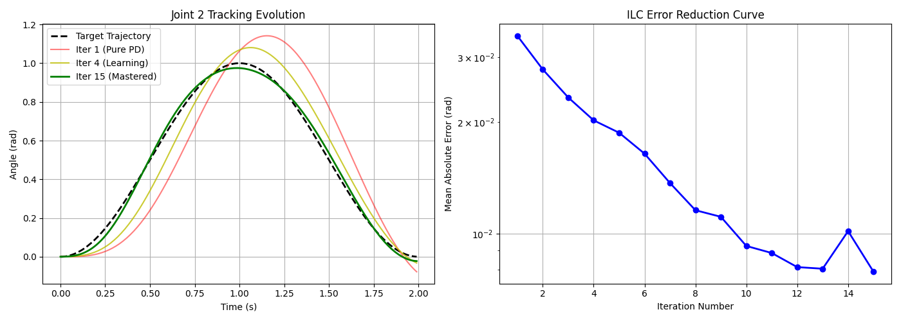
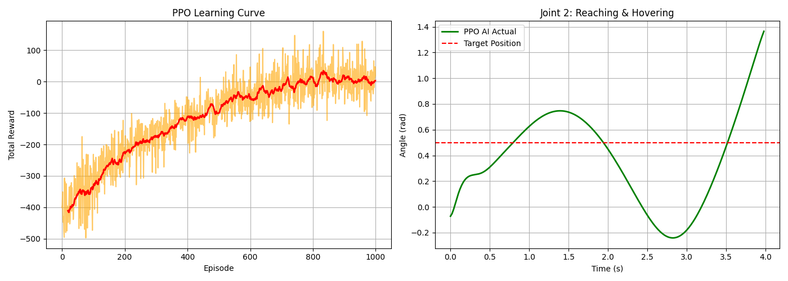

# 🤖 6-DOF Robotic Arm: From Kinematics to Reinforcement Learning

[](https://www.python.org/)
[](https://pytorch.org/)
[](https://numpy.org/)
[](LICENSE)

本项目是一个完整的端到端六轴机械臂算法演进全纪录。涵盖了从最底层的**数学建模（运动学/动力学）**，到**传统经典控制（CTC）**，再到**前沿深度学习（模仿学习 BC & 强化学习 PPO）**的完整技术栈。

通过这 8 周的迭代，本项目展示了如何让一个“毫无物理常识”的神经网络，一步步进化为能够精准抗重力悬停、完美追踪复杂轨迹的智能大脑。

---

## 📸 Demo 展示
*(提示：在这里放两到三张你跑出来的结果图或 GIF 动图)*



---

## 🚀 核心里程碑与技术栈 (The 8-Week Journey)

### Phase 1: 物理基石 —— 运动学与动力学 (Week 1-4)
* **正逆运动学 (FK & IK)**：建立标准 D-H 参数模型，使用雅可比矩阵伪逆法 (Jacobian Pseudo-inverse) 实现逆运动学迭代求解，笛卡尔空间闭环追踪误差 < 1mm。
* **物理引擎与动力学 (Dynamics)**：推导并实现基于牛顿-欧拉法的完整动力学方程，包含质量矩阵 $M(q)$、科里奥利力 $C(q, \dot{q})$ 与重力项 $G(q)$。
* **经典控制理论 (CTC)**：编写计算力矩控制器 (Computed Torque Control)，实现对高频混合正弦波的完美轨迹追踪，作为后续 AI 训练的“专家导师”。

### Phase 2: 赋予直觉 —— 模仿学习 / 行为克隆 (Week 5-7)
* **消除信息不对称**：将状态空间从 12 维扩展至 30 维（融合当前姿态与目标轨迹的各阶导数），解决神经网络视野受限导致的 Loss 卡死问题。
* **DAgger 思想与数据增强**：在数据收集中主动引入物理状态噪音，并由 CTC 专家重新计算“救车力矩”，极大提升了策略在非分布状态下的鲁棒性。
* **全局特征归一化 (Normalization)**：实现状态与动作空间的标准化映射，打破量纲灾难，使 MSE Loss 呈指数级下降并稳定收敛。

### Phase 3: 自我进化 —— PPO 强化学习连续控制 (Week 8)
* **定制化 Gym 环境**：从零构建支持物理推演、具有严格限位防范与“幽灵动量 (Phantom Momentum)”消除机制的交互环境。
* **残差控制 (Residual Control)**：首创“物理外骨骼 + AI微调”架构，利用物理公式抵消重力，大幅降低 AI 动作空间的探索难度。
* **高阶奖励塑形 (Reward Shaping)**：弃用传统的断崖式阶梯奖励，创新性引入**高斯引力井 (Gaussian Attraction Well)** 与动作平滑惩罚，引导 Actor 网络稳定跨越局部最优解，实现完美的定点悬停。

---
## 📂 项目结构 (Project Architecture)

整个项目遵循高内聚、低耦合的工程规范，分为核心源码区与测试验证区：

```text
.
├── src/                             # 核心算法与源码目录 (Core Modules)
│   ├── robotic_arm.py               # 底层运动学核心：D-H 参数建模、FK 正解、IK 闭环逆解
│   ├── robotic_arm_dynamics.py      # 动力学引擎：质量/科里奥利力/重力矩阵推演与 CTC 控制
│   ├── robotic_arm_optimization.py  # 优化求解器：局部最优规避与非线性姿态优化
│   ├── robotic_arm_imitation.py     # 模仿学习：DAgger 数据采集、归一化引擎与 BC Agent
│   ├── robotic_arm_PPO.py           # 强化学习：物理环境包装器 (Env) 与 PPO 连续控制网络
│   ├── trajectory.py                # 轨迹规划器：笛卡尔空间与关节空间的多项式/样条插值
│   ├── visualizer.py                # 渲染引擎：机械臂 3D 姿态与轨迹实时可视化
│   └── gui_control.py               # 交互控制台：提供友好的上位机 GUI 调试界面
│
├── tests/                           # 单元测试与基准测试 (Tests & Benchmarks)
│   ├── test_inverse_kinematics.py   # 运动学精度验证：笛卡尔空间轨迹追踪与误差闭环分析
│   ├── test_performance.py          # 性能压测栈：核心矩阵运算与 IK 求解器的吞吐量 Benchmark
│   ├── test_optimization.py         # 优化模块测试：边界条件与奇点规避测试
│   ├── test_imitation.py            # 模仿学习验收：神经网络克隆策略的轨迹跟随评估
│   └── test_PPO.py                  # 强化学习总控：PPO 模型训练循环、日志打印与收敛可视化
│
├── README.md                        # 项目说明文档
└── requirements.txt                 # 环境运行依赖